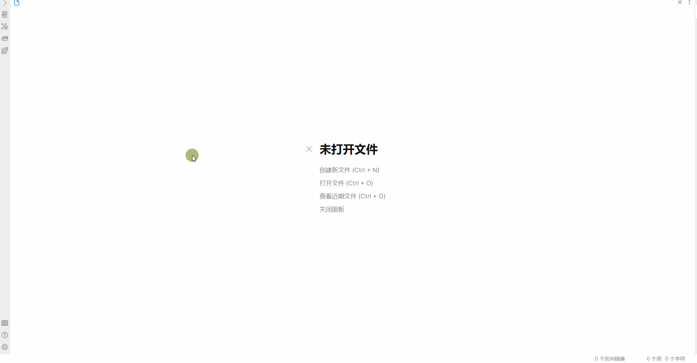
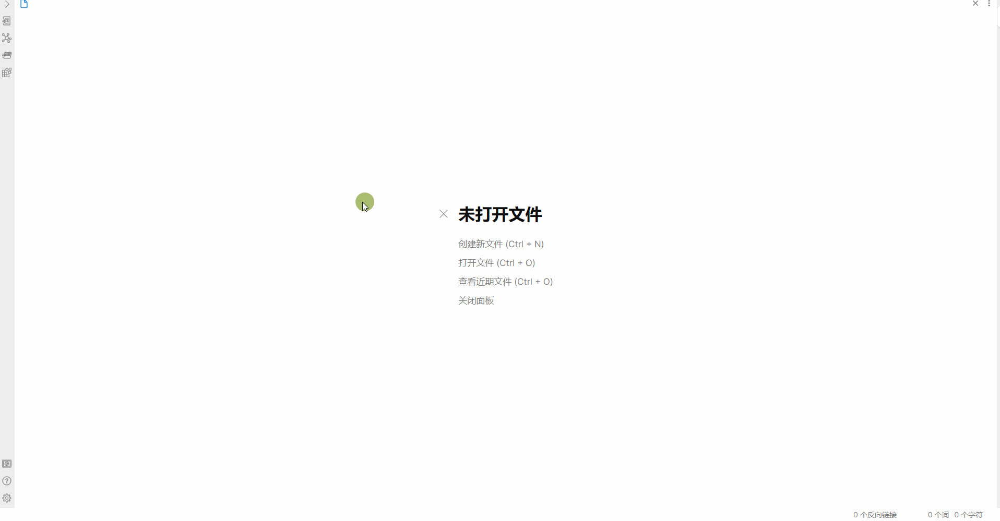

# Obsidian Path Finder Plugin

## Install

### From Obsidian 

1. Open `Settings` > `Third-party plugin`
2. Make sure Safe mode is off
3. Click `Browse community plugins`
4. Search for this plugin
5. Click `Install`
6. Once installed, close the community plugins window and the plugin is ready to use.

### From BRAT

1. Install [Obsidian42-BRAT](https://github.com/TfTHacker/obsidian42-brat) plugin.
2. Click `Add new beta plugin` and fill in `jerrywcy/obsidian-path-finder`.
3. Activate plugin.

### From Github Release

1. Download `obsidian-path-finder.zip` from [Releases](https://github.com/jerrywcy/obsidian-path-finder/releases).
2. Decompress the `.zip` file and put the folder `obsidian-path-finder` under `path-to-your-vault/.obsidian/plugins/`.
3. Activate plugin(Maybe require refreshing).

## Feature

### Find shortest path between two files

**From:** The file to start from. Use full path from vault root to the file.

**To:** The file to end with. Use full path from vault root to the file.
### Find all paths between files as graph

**From:** The file to start from. Use full path from vault root to the file.

**To:** The file to end with. Use full path from vault root to the file.

**Length:** The maximum length of all paths. Often a path that is too long can be meaningless, so length limitation may be necessary. Set 0 to show all paths regardless of length. **Setting length to 0 may lead to Obsidian crushing due to mass amount of nodes rendering if your vault is too big, so use at your own risk.**

Paths shown in the floating panel will be sorted from the shortest to the longest. Each path will be calculated on button click, so no need to worry about crushing.

### Find all paths

**From:** The file to start from. Use full path from vault root to the file.

**To:** The file to end with. Use full path from vault root to the file.

**Length:** The maximum length of all paths. Set 0 to show all paths regardless of length.

Paths will be sorted from the shortest to the longest. Each path will be calculated on button click, so no need to worry about crushing.

## Attribution

- `genericTextSuggester.ts` and `suggest.ts` are taken from [phibr0/obsidian-dictionary](https://github.com/phibr0/obsidian-dictionary).
- `d3ForceGraphWithLabels.ts`is taken and adapted from examples in d3Gallery with their links below:
    - https://observablehq.com/@d3/force-directed-graph
    - https://observablehq.com/@d3/force-directed-graph-canvas
    - https://observablehq.com/@d3/mobile-patent-suits
    - https://observablehq.com/@d3/sticky-force-layout
    - https://observablehq.com/@d3/zoom
    - https://observablehq.com/@d3/temporal-force-directed-graph
    - These examples above follow ISC License with the copyright message below: 
        - Copyright 2021 Observable, Inc.
        - Released under the ISC license.