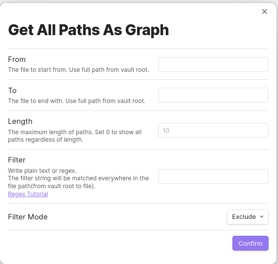
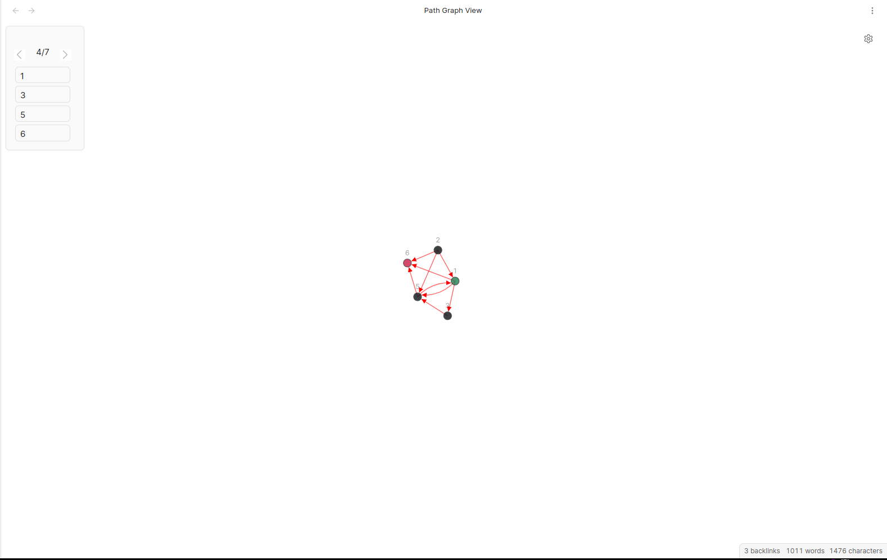
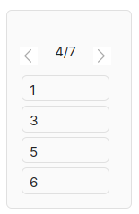
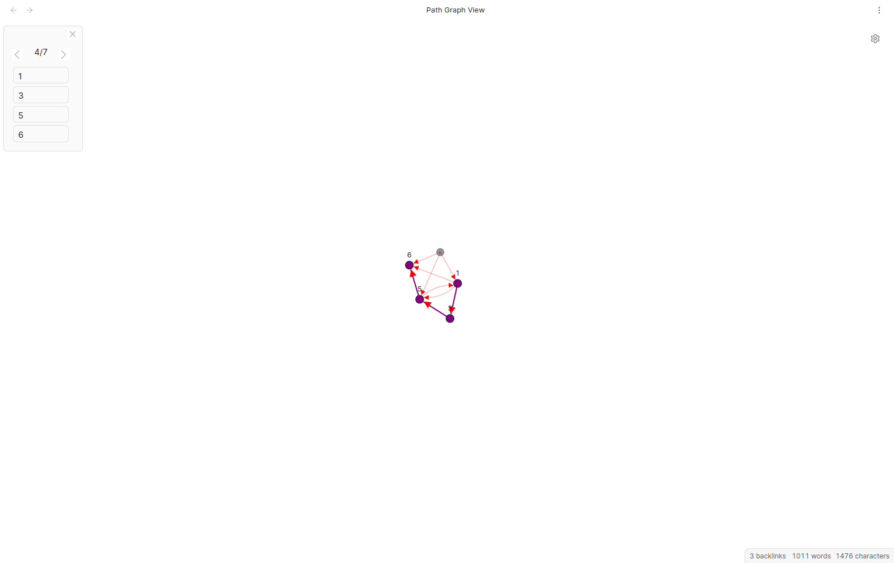
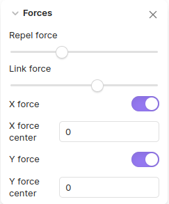
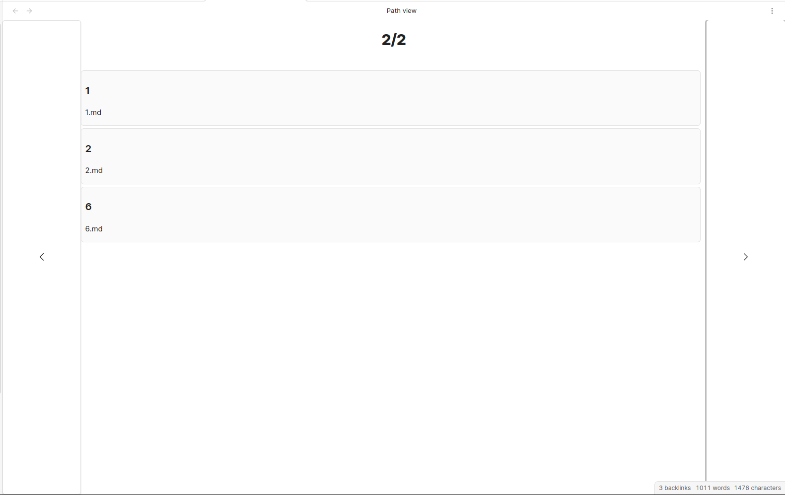

# Obsidian Path Finder Plugin

## Install

### From Obsidian

1. Open `Settings` > `Third-party plugin`
2. Make sure Safe mode is off
3. Click `Browse community plugins`
4. Search for this plugin
5. Click `Install`
6. Once installed, close the community plugins window and the plugin is ready to use.

### From BRAT

1. Install [Obsidian42-BRAT](https://github.com/TfTHacker/obsidian42-brat) plugin.
2. Click `Add new beta plugin` and fill in `jerrywcy/obsidian-path-finder`.
3. Activate plugin.

### From GitHub Release

1. Download `obsidian-path-finder.zip` from [Releases](https://github.com/jerrywcy/obsidian-path-finder/releases).
2. Decompress the `.zip` file and put the folder `obsidian-path-finder` under `path-to-your-vault/.obsidian/plugins/`.
3. Activate plugin(Maybe require refreshing).

## Feature

### Find shortest path between two files

**From:** The file to start from. Use full path from vault root to the file.

**To:** The file to end with. Use full path from vault root to the file.

### Find all paths between files as graph

**From:** The file to start from. Use full path from vault root to the file.

**To:** The file to end with. Use full path from vault root to the file.

**Length:** The maximum length of all paths. Often a path that is too long can be meaningless, so length limitation may be necessary. Set 0 to show all paths regardless of length. **Setting length to 0 may lead to Obsidian crushing due to mass amount of nodes rendering if your vault is too big, so use at your own risk.**

Paths shown in the floating panel will be sorted from the shortest to the longest. Each path will be calculated on button click, so no need to worry about crushing.

### Find all paths

**From:** The file to start from. Use full path from vault root to the file.

**To:** The file to end with. Use full path from vault root to the file.

**Length:** The maximum length of all paths. Set 0 to show all paths regardless of length.

Paths will be sorted from the shortest to the longest. Each path will be calculated on button click, so no need to worry about crushing.

## Introduction to Views

Generally, there are two kinds of views, Path View and Path Graph View.

Path View illustrate all possible paths in lists, while Path Graph View illustrate all possible paths in a directed graph, with more details.

### Path Graph View

This is the modal for opening a Path Graph View.

Most options are clearly explained.

Note that configuration for filter here will only apply for the Path Graph View to be opened but not the default filter. This is designed so that people can set a default filter for most situation and alternate filter as needed while not affecting default settings.

This is the Path Graph View.

The upper left is Path Panel that illustrates all paths.

When the mouse hover on Path Panel, the path shown by the Path Panel will be highlighted on the graph.

When the mouse hover on a node in the Path Panel, the path will be highlighted and the node will be especially highlighted.

Here are some settings for graphs.

**Repel force** mean repelling force between nodes. Greater repel force will make nodes farther away from each other.

**Link force** mean tension on links. Greater link force will make link shrink more.

**X force** mean force that gather nodes together on X axis. Greater X force will compress nodes more on X axis.

**Y force** mean force that gather nodes together on Y axis. Greater Y force will compress nodes more on Y axis.

Tip: every time you zoom in or out or drag the graph, the backfire parameter is reset and thus the graph gets active. So if your graph got tangled maybe try to zoom in or out or drag it around, then it will arrange itself into a more organized shape.

### Path View

This is the Path View.

As you can see, all possible paths were illustrated in lists.

There is one thing to notice: for the total number of paths shown, the number may not be the final number. This is because I used a generative approach that calculates the next path and update path number. This is designed to avoid lag due to large amount of calculation.

## Settings

**Previous Path:** the keybinding to switch to the previous path in Path Panel. Press reset key to reset to default. Defaulted to `Arrow Left`.

**Next Path:** the keybinding to switch to the next path in Path Panel. Press reset key to reset to default. Defaulted to `Arrow Right`.

**Open Panel:** the keybinding to open Path Panel. Press reset key to reset to default. Defaulted to `O`.

**Close Panel:** the keybinding to close Path Panel. Press reset key to reset to default. Defaulted to `W`.

**Filter:** the default Regex filter for files to show in paths. Match everything when set to empty. This can be modified in Path Modal without affecting the default setting.

**Filter Mode:** Either to include or exclude all files specified by Filter. Can be modified in Path Modal withou affecting the default setting.

## Attribution

-   `genericTextSuggester.ts` and `suggest.ts` are taken from [phibr0/obsidian-dictionary](https://github.com/phibr0/obsidian-dictionary).
-   `d3ForceGraphWithLabels.ts`is taken and adapted from examples in d3Gallery with their links below:
    -   https://observablehq.com/@d3/force-directed-graph
    -   https://observablehq.com/@d3/force-directed-graph-canvas
    -   https://observablehq.com/@d3/mobile-patent-suits
    -   https://observablehq.com/@d3/sticky-force-layout
    -   https://observablehq.com/@d3/zoom
    -   https://observablehq.com/@d3/temporal-force-directed-graph
    -   These examples above follow ISC License with the copyright message below:
        -   Copyright 2021 Observable, Inc.
        -   Released under the ISC license.
